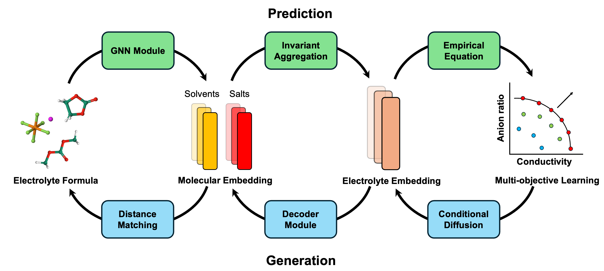

<div align="center">
 👋 Hi, everyone! 
    <br>
    We are <b>ByteDance Seed team.</b>
</div>

<p align="center">
  You can get to know us better through the following channels👇
  <br>
  <a href="https://seed.bytedance.com/">
    </a>
  <a href="https://github.com/user-attachments/assets/5793e67c-79bb-4a59-811a-fcc7ed510bd4">
    </a>
 <a href="https://www.xiaohongshu.com/user/profile/668e7e15000000000303157d?xsec_token=ABl2-aqekpytY6A8TuxjrwnZskU-6BsMRE_ufQQaSAvjc%3D&xsec_source=pc_search">
    </a>
  <a href="https://www.zhihu.com/org/dou-bao-da-mo-xing-tuan-dui/">
    </a>
</p>

<div align="center">
  
</div>

<!-- 注释：以上为Seed官方信息，可直接复制使用，请注意导入“Seed WeChat”（第12行）、“Seed logo”(第20行)图片替换 -->


# A Predictive and Generative Solution for Liquid Electrolyte Formulation
<p align="center">
  <a href="https://huggingface.co/ByteDance-Seed/bamboo_mixer">
    </a>
  <a href="https://www.apache.org/licenses/LICENSE-2.0">
    </a>
</p>

We are extremely delighted to release **Bamboo-Mixer**. **Bamboo-Mixer** introduces a unified method to not only **predict electrolyte properties** accurately such as conductivity and anion ratio, but also allows **conditional generation** of electrolyte formulation based on target properties. 

This innovation provides a generative workflow to **design molecular mixture** beyond electrolyte. The generated samples from the workflow are tested and proved further with experimental validation..

## Data preparation
There are two different types of data: [`MonoData`](./formula_design/data/data.py#L272) and [`FormulaData`](./formula_design/data/data.py#L362)
- [`MonoData`](./formula_design/data/data.py#L272): single molecule data with molecular property labels.
- [`FormulaData`](./formula_design/data/data.py#L362): Molecular mixture data for liquid electrolytes with conductivity and anion ratio information. 

More details about how to prepare data for different stages of training and inference can be found in [Data Preparation Instructions](./scripts/prepare_data/README.md).

## Training
**Predictive model (Three-stage training):**
1. Molecular pretraining: Multi-task learning of molecular property predictions.
2. Computational pretraining: Prediction of formulation property from MD simulation.
3. Experimental fine-tuning: Fine-tuning with experimental conductivity data. 

**Generative model (Dual-stage training):**
1. Conditional diffusion: conditional DDPM to generate electrolyte embedding.
2. Decoder and distance matching: decode electrolyte embedding and obtain formulation.

See [Training Instructions](./scripts/train/README.md) for more details.

## Inference and Generation
**Molecular property prediction (11 molecular properties):**
- Tₘ: melting point (K)
- bp: boiling point (K)
- nD: refractive index (unitless)
- nD_liquid: refractive index (liquid, unitless)
- pka_a: pKa (unitless)
- pka_b: pKb (unitless)
- dc: dielectric constant (unitless)
- ST: surface tension (mN/m)
- density: mass density (g/cm^3)
- vis: viscosity (cP)
- vapP: vapor pressure (Pa)

**Predictive model (2 electrolyte properties):**
- Conductivity (mS/cm).
- Anion ratio (unitless, between 0 and 1).

**Generative model (3 generated files):**
- Electrolyte embedding.
- BoM vector of formulation.
- Corresponding conductivity and anion ratio.

See [Inference Instructions](./scripts/test_results/README.md) for more details.

## Data availability
The datasets and checkpoints can be found on HuggingFace: [huggingface/bamboo_mixer](https://huggingface.co/ByteDance-Seed/bamboo_mixer)


## Contributing
We welcome contributions to BAMBOO-Mixer! If you have suggestions or improvements, please refers to `CONTRIBUTING.md`


## License
This project is licensed under the [Apache License, Version 2.0](https://www.apache.org/licenses/LICENSE-2.0).

## Citation
If you find BAMBOO-Mixer useful for your research and applications, feel free to give us a star ⭐ or cite us using:

```bibtex
@misc{yang2025unifiedpredictivegenerativesolution,
      title={A Unified Predictive and Generative Solution for Liquid Electrolyte Formulation}, 
      author={Zhenze Yang and Yifan Wu and Xu Han and Ziqing Zhang and Haoen Lai and Zhenliang Mu and Tianze Zheng and Siyuan Liu and Zhichen Pu and Zhi Wang and Zhiao Yu and Sheng Gong and Wen Yan},
      year={2025},
      eprint={2504.18728},
      archivePrefix={arXiv},
      primaryClass={cond-mat.mtrl-sci},
      url={https://arxiv.org/abs/2504.18728}, 
}
```

## About [ByteDance Seed Team](https://seed.bytedance.com/)

Founded in 2023, ByteDance Seed Team is dedicated to crafting the industry's most advanced AI foundation models. The team aspires to become a world-class research team and make significant contributions to the advancement of science and society.

<!-- 注释：About ByteDance Seed Team可直接复制使用 -->

